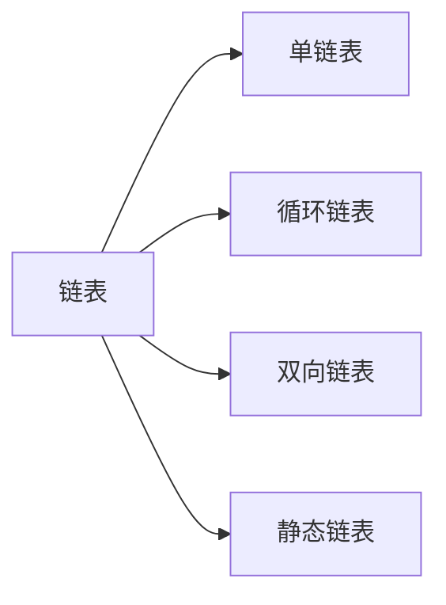


*  目录
{:toc}

我也在自己学习算法的过程中的不断总结，为了今后复习和回顾的时候方便查阅

下面是我的学习过程的一些总结：

## 一、数组
- 数组是一种线性表数据结构，用一个连续的内存空间，来存储一组具有相同类型的数据
1. 了解线性表（数组、链表、队列、栈等）和非线性表（树、堆、图）
2. 连续的内存空间和相同数据类型的数据，这两点使得数组可以实现随机访问

## 二、链表
- 链表是一种物理存储单元上非连续，非顺序的存储结构，数据元素的逻辑顺序是通过链表中的指针链表次序实现的

链表存在多种形式：

#### 单链表
- 每个节点包括两个部分；一个是存储数据元素的数据域，另一个是存储下一个结点地址的指针域，只有一个后缀结点

#### 循环链表
1. 尾部点指针指向头结点的链表
2. 可以是单链表，也可以是双向链表

#### 双向链表
1. 不同于单向链表只有一个方向，结点只有一个后继指针next指向后面的结点
2. 双向链表，支持两个方向，每个结点不止有一个后缀指针next指向后面的结点，还有一个前驱指针prev指向前面的结点
3. 占用更多空间的同时插入和删除效率更高

#### 静态链表
1. 用数组描述的链表，即称为静态链表
2. 首先让数组的元素都是由两个数据域构成，data和cur，也就是说每一个数组的下标都要对应一个data和一个cur
3. 数据域data用来存放数据元素，也就是通常我们要处理的数据，而cur相当于单链表中的next指针，存放该元素的后继在数组中的下标，我们把cur叫做游标

## 三、栈
- 栈是一种“操作受限”的线性表，体现在只能在一端插入删除数据，符合先进先出的特性

## 四、队列
- 队列也是一种“操作受限”的线性表，体现先进先出的原则

队列存在多种形式：

```
graph LR
队列-->双端队列
队列-->优先队列
```

#### 双端队列
- 是一种具有队列和栈性质的数据结构。双端队列中的元素可以从两端弹出，其限定插入和删除操作的队列的两端进行

#### 优先队列（priority queue）
- 普通的队列是一种先进先出的数据结构，元素在队列尾追加，而从队列头删除。在优先队列中，元素被赋予优先级。当访问元素时，具有最高优先级的元素最先删除。优先队列具有最高级先出 （first in, largest out）的行为特征。通常采用堆数据结构来实现。

## 五、堆
1. 堆是一个完全二叉树
2. 堆中每个结点的值都必须大于等于（或小于等于）其子树中每个结点的值都大于等于的叫大顶堆，都小于等于的叫小顶堆

## 六、树
- 树是一种非线性结构，就像真实的树倒挂。
- 树是包括n（n≥0）个结点的有穷级，其中每个元素称为结点，有一个结点被称为根结点，除根结点之外的其余元素分为m（m≥0）,其中m也是一颗树

树也有多种形式：

```
graph LR
树-->完全二叉树
树-->满二叉树树
树-->二叉搜索树
树-->平衡二叉搜索树
树-->红黑树
```

#### 完全二叉树
- 每层结点都完全填满，在最后一层上如果不是满的，则只缺少右边的若干结点。

#### 满二叉树树
- 符合叶子结点全部在最低层，除叶子结点外，每个结点都有左右俩个子结点的条件就是满二叉树

#### 二叉搜索树
- 在树中的任意一个结点，其左子树的值都小于这个结点的值，而右子树结点的值都大于这个结点的值

#### 平衡二叉搜索树（AVL）
- 考虑二叉树的高度可能退化成单链表的情况，造成插入、删除的效率变成O(n)，因此设计出了平衡二叉搜索树，高度接近logn，也因此插入删除和查找的时间复杂度接近O(logn)
- 二叉树中任意一个结点的左右子树的高度差不能大于1

#### 红黑树
1. 树的结点一类是红色的，一类是黑色的
2. 根结点是黑色的
3. 每个叶子结点都是黑色的空结点，叶子结点不存储数据
4. 任何相邻的结点都不能同时为红色，红色结点被黑色结点隔开
5. 每个结点，从该结点到达其可达叶子结点的左右路径，都包含数目的黑色系结点

## 七、图
- 图是有顶点的有穷非空集合和顶点之间的集合组成，通常表示为G（V，E），其中G表示一个图，V是图G中顶点的集合，E是图中G中边的集合

图的多种形式：

```
graph LR
图-->无向图
图-->有向图
图-->完全图
完全图-->无向完全图
完全图-->有向完全图
```

#### 无向图
- 如果图中任意两个顶点之间的边都是无向边，就称为无向图

#### 有向图
- 如果图中任意两个顶点之间的边都是有向边，就称为有向图

#### 完全图
1. 无向完全图：在无向图中，如果任意两个顶点之间都存在边，就是无向完全图
2. 有向完全图：在有向图中，如果任意两个顶点之间都存在方向互为相反的两条弧，就是有向完全图
3. 当一个图接近完全图时，称它为稠密图。而当一个图含较少的边时，则是稀疏图


## 八、布隆过滤器
- 布隆过滤器实际上是一个很长的二进制向量和一系列随机映射函数。布隆过滤器可以用于检索一个元素是否在一个集合中。它的优点是空间效率和查询时间都比一般的算法要好很多，缺点是有一定的误识别率和删除空难

## 九、LRU Cache
- 缓存是一个提高数据读取性能的技术，在软硬件都有广泛的应用。CPU缓存、数据库缓存、浏览器缓存等常见的淘汰策略有FIFO先进先出策略，LFU最少使用策略、LRU最近最少使用策略

## 十、散列表
- 也称Hash Table、哈希表、Hash表，支持高校的数据插入、删除、查找操作，根据key直接访问在内存存储位置的数据散列表来源于数组，借助散列函数对这个数组结构进行扩展，利用的是数组支持按照下标随机访问元素的特性

## 十一、并查集
- 并查集是一种树型的数据结构，用于处理一些不相交集合的合并及查询问题

## 十二、排序算法

```
graph LR
排序-->插入排序
插入排序-->直接插入排序
插入排序-->希尔排序
排序-->选择排序
选择排序-->简单选择排序
选择排序-->堆排序
排序-->交换排序
交换排序-->冒泡排序
交换排序-->快速排序
排序-->归并排序
排序-->基数排序
```

<table>
    <tr>
        <th rowspan="2"> 排序方式</th>
        <td colspan="3">时间复杂度</td>   
        <td rowspan="2">空间复杂度</td>   
        <td rowspan="2">稳定性</td>   
        <td rowspan="2">复杂性</td>   
    </tr>
    <tr>
        <td colspan="1">平均情况</td>   
        <td colspan="1">最坏情况</td>
        <td colspan="1">最好情况</td>
    </tr>
    <tr>
        <td colspan="1">插入排序</td>   
        <td colspan="1">O(n²)</td>
        <td colspan="1">O(n²)</td>
        <td colspan="1">O(n)</td>
        <td colspan="1">O(1)</td>
        <td colspan="1">稳定</td>
        <td colspan="1">简单</td>
    </tr>
    <tr>
        <td colspan="1">希尔排序</td>   
        <td colspan="1">O(n^(3/2))</td>
        <td colspan="1"> </td>
        <td colspan="1"> </td>
        <td colspan="1">O(1)</td>
        <td colspan="1">不稳定</td>
        <td colspan="1">较复杂</td>
    </tr>
    <tr>
        <td colspan="1">冒泡排序</td>   
        <td colspan="1">O(n²)</td>
        <td colspan="1">O(n²)</td>
        <td colspan="1">O(n)</td>
        <td colspan="1">O(1)</td>
        <td colspan="1">稳定</td>
        <td colspan="1">简单</td>
    </tr>
    <tr>
        <td colspan="1">快速排序</td>   
        <td colspan="1">O(nlogn)</td>
        <td colspan="1">O(n²)</td>
        <td colspan="1">O(nlogn)</td>
        <td colspan="1">O(logn)</td>
        <td colspan="1">不稳定</td>
        <td colspan="1">较复杂</td>
    </tr>
    <tr>
        <td colspan="1">选择排序</td>   
        <td colspan="1">O(n²)</td>
        <td colspan="1">O(n²)</td>
        <td colspan="1">O(n²)</td>
        <td colspan="1">O(1)</td>
        <td colspan="1">不稳定</td>
        <td colspan="1">简单</td>
    </tr>
    <tr>
        <td colspan="1">堆排序</td>   
        <td colspan="1">O(nlogn)</td>
        <td colspan="1">O(nlogn)</td>
        <td colspan="1">O(nlogn)</td>
        <td colspan="1">O(1)</td>
        <td colspan="1">不稳定</td>
        <td colspan="1">较复杂</td>
    </tr>
    <tr>
        <td colspan="1">归并排序</td>   
        <td colspan="1">O(nlogn)</td>
        <td colspan="1">O(nlogn)</td>
        <td colspan="1">O(nlogn)</td>
        <td colspan="1">O(n)</td>
        <td colspan="1">稳定</td>
        <td colspan="1">较复杂</td>
    </tr>
    <tr>
        <td colspan="1">堆排序</td>   
        <td colspan="1">O(d(n+rd))</td>
        <td colspan="1">O(d(n+rd))</td>
        <td colspan="1">O(d(n+rd))</td>
        <td colspan="1">O(rd)</td>
        <td colspan="1">稳定</td>
        <td colspan="1">较复杂</td>
    </tr>
</table>

1. 插入排序
- 将一个记录插入到已排序好的有序表中，从而得到一个记录数据增的有序表
2. 希尔排序
- 先将整个待排序的记录序列分割成若干子序列分别进行直接插入排序，待整个序列中的记录“基本有序”时，再对全体记录进行一次直接插入排序
3. 选择排序
- 选择排序（Selection sort）是一种简单直观的排序算法。 它的工作原理是：第一次从待排序的数据元素中选出最小（或最大）的一个元素，存放在序列的起始位置，然后再从剩余的未排序元素中寻找到最小（大）元素，然后放到已排序的序列的末尾。 以此类推，直到全部待排序的数据元素的个数为零。 选择排序是不稳定的排序方法。
4. 堆排序
- 堆是一个近似完全二叉树的结构，并同时满足堆积的性质：即子节点的键值或索引总是小于（或者大于）它的父节点。
5. 冒泡排序
- 冒泡排序（Bubble Sort），是一种计算机科学领域的较简单的排序算法。 它重复地走访过要排序的元素列，依次比较两个相邻的元素，如果顺序（如从大到小、首字母从Z到A）错误就把他们交换过来。 走访元素的工作是重复地进行直到没有相邻元素需要交换，也就是说该元素列已经排序完成。
6. 快速排序
- 快速排序（英语：Quicksort），又称分区交换排序（partition-exchange sort），简称快排，一种排序算法，最早由东尼·霍尔提出。在平均状况下，排序 n个项目要O(nlog n)（大O符号）次比较。在最坏状况下则需要 O(n^2) 次比较，但这种状况并不常见。事实上，快速排序 O(nlogn)通常明显比其他算法更快，因为它的内部循环（inner loop）可以在大部分的架构上很有效率地达成。
7. 归并排序
- 将两个（或两个以上）有序表合并成一个新的有序表，即把待排序序列分为若干个子序列，每个子序列都是有序的，然后再把有序子序列合并为整体有序序列
8. 基数排序
- 基数排序（英语：Radix sort）是一种非比较型整数排序算法，其原理是将整数按位数切割成不同的数字，然后按每个位数分别比较。由于整数也可以表达字符串（比如名字或日期）和特定格式的浮点数，所以基数排序也不是只能使用于整数。

## 十三、递归
- 方法或函数调用自身的方式称为递归调用，调用称为递，返回称为归

## 十四、哈希算法
- 将任意长度的二进制串映射为固定长度的二进制值串，这个映射的规则就是哈希算法，而通过原始数据映射之后得到的二进制串就是哈希值

## 十五、二分查找
- 二分查找每次选取区间的中间元素进行比较，将查找的区间缩小为一半，直到找到要查找的元素或者区间长度为0结束查找，思想类似分治

## 十六、搜索算法

搜索算法多种形式：

```
graph LR
搜索算法-->BFS广度优先
搜索算法-->DFS深度优先
搜索算法-->A-Star算法
```

#### BFS广度优先
- BFS是从一个顶点V0开始，沿着图的宽度遍历图中的结点，如果所有结点均被访问或者找到要查找的元素，则算法终止。一般用队列进行辅助实现，采用地毯式搜索

#### DFS深度优先
- DFS是从一个顶点V0开始，沿着一条路一直走到底，如果发现不到达目标解，那就返回到上一个结点，然后从另一条路开始走到底，这种尽量往深处走的概念即是深度优先，利用的是回溯算法思想

#### A*(A-Star)算法
A*(A-Star)算法是一种静态路网中求解最短路径最有效的直接搜索方法，也是解决许多搜索问题的有序算法，算法中的距离估算值于实际值越近，最终搜索速度越快。

## 十七、字符串算法
字符串算法多种形式：

```
graph LR
字符串算法-->BF算法
字符串算法-->RK算法
字符串算法-->BM算法
字符串算法-->KMP算法
字符串算法-->Tire树
字符串算法-->AC自动机
```

#### BF算法
Brute Force即暴力匹配法，在主串中每次向右移动一个位置与模式串比较，如果每个字符都相等，则表示在主串中找到模式串

#### RK算法
- 在BF中，每次比较模式串和主串子串匹配的时候，都需要依次比较，RK则是使用哈希算法对上述的优化

#### BM算法
- 把主串和模式串的匹配过程看成模式串不停往右滑动，当遇到不匹配的字符时，模式串往后滑动一位，然后从模式串的第一位开始匹配，BM算法借助一些规律将模式串向右滑动几位

#### KMP算法
- 跟BM算法非常近似，在模式串和主串匹配过程中，当遇到那些不可匹配的字符时，希望有某些规律将模式串往右滑动几位，跳过那些肯定不会匹配的情况

#### Tire树
- 也称字典树，是一个树型结构，专门用于处理字符串匹配的数据结构，用来解决在一组字符集合中，快速查找到某个字符串的问题

#### AC自动机
- AC自动机就是在Tire树之上，加了类似KMP的next数组，只不过此处的next数组是构建在树之上

## 十八、位运算
- 程序中的所有数在计算机内存中都是以二进制的形式存储的，位运算就是直接对整个在内存中的二进制位进行操作

| 左移 | 右移 | 按位或 | 按位与 | 按位取反 |  按位异或   |
| ---- | ---- | :----: | :----: | :------: | :---------: |
| <<   | >>   |   \|   |   &    |    ~     | ^(同0不同1) |

- 注意：&、|、^ 优先级比比较运算符低

## 十九、贪心算法
- 贪心算法是指在对问题求解时，总是做出在当前看来是最好的选择。由于不从整体最优上加以考虑，所做出的是在某种意义上的局部最优解

## 二十、分治算法
- 核心思想是分而治之，将原问题划分为n个规模较小并且结构与原问题相似的子问题，递归的解决这些子问题，再合并其结果，得到原问题的解
- 每次递归都会涉及到三个操作：
    1. 分解：子问题
    2. 解决：求解各个子问题
    3. 合并：将子问题合并成原问题

## 二十一、回溯算法
- 回溯算法实际上类似枚举的搜索尝试过程，主要在搜索尝试的过程中寻找问题的解，当发现已不满足求解条件时，就“回溯”返回，尝试别的路径。

## 二十二、动态规划
- 每次决策依赖于当前状态，又随即引起状态转移，一个决策序列就是在变化的状态中产生出来的，所以，这种多阶段最优化决策解决问题的过程就称为动态规划
1. 最优子结构：通过子问题最优推到出问题最优
2. 无后效性：某个阶段状态一旦确定，就不受这个状态之后影响
3. 重复子问题：不同的决策序列，达到某个相同阶段是，可产生重复状态

### 回溯、贪心、分治、动态规划的比较
1. 回溯法指数级别的算法复杂度比较高，只能用来解决小规模数据问题
2. 能用动态规划的问题具有最优子结构，无后效性和重复子问题三个特性
3. 在重复子问题上、分治算法要求分割成的子问题不能有重复子问题，而动态规划正相反
4. 贪心算法实际是动态规划的一种特殊情况


